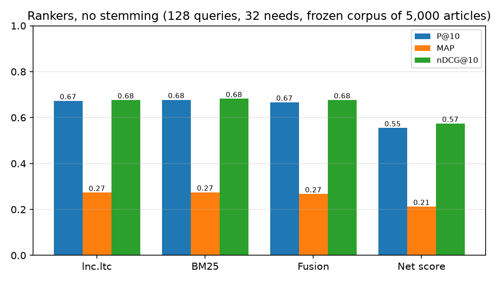
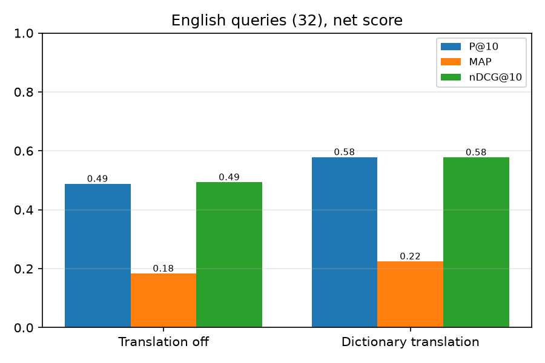
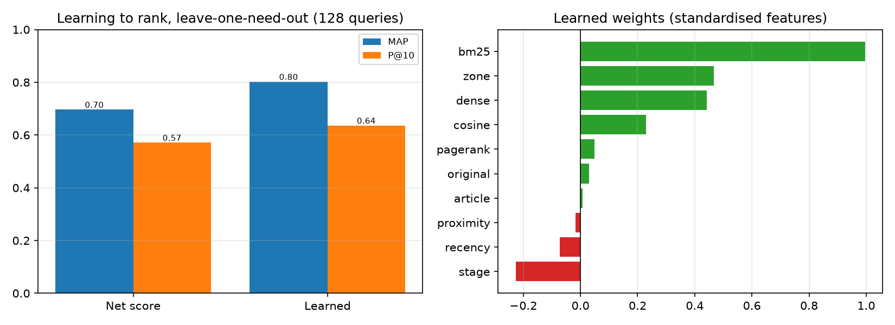

<div align="center">

# ध्वनि · Dhvani

**Type it in Hindi, Hinglish or English, and get the same Hindi news.**

A search engine for Hindi news that works no matter which script or spelling the query uses.
CSD358 Information Retrieval, mid-term hackathon, **Track 5: Indian-language and code-mixed search**.

`भूकंप के झटके` · `bhukamp ke jhatke` · `earthquake tremors` → the same articles

</div>

---

## Contents

1. [The problem](#the-problem)
2. [What it does](#what-it-does)
3. [Setup](#setup)
4. [How to run it](#how-to-run-it)
5. [Running each part on its own](#running-each-part-on-its-own)
6. [Where the data comes from](#where-the-data-comes-from)
7. [How it works](#how-it-works)
8. [Evaluation](#evaluation)
9. [What works and what is still planned](#what-works-and-what-is-still-planned)
10. [Repository layout](#repository-layout)
11. [Documentation](#documentation)
12. [Team](#team)
13. [AI use](#ai-use)

---

## The problem

People in India don't search in one language. One reader types `भूकंप के झटके`, another types `bhukamp ke jhatke` and spells it however they like, and a third types `earthquake tremors`. Most search engines treat these as three unrelated queries, so the Hinglish and English searches miss the Hindi news.

Hindi also has no standard Roman spelling, its words change form a lot, and news is full of names. Dhvani (Hindi for "sound") matches words by **how they sound** and translates English using a dictionary it **learns from its own corpus**. It also runs each search three ways (no stemming, light stemming and selective "auto" stemming), so you can see what stemming changes, which is the Track 5 question.

## What it does

| | |
|---|---|
| **A corpus we built ourselves** | 5,000 Hindi news articles, crawled from five national dailies with a polite, robots-compliant crawler, cleaned and deduplicated |
| **Three query forms, one result** | Hindi, Hinglish (any spelling) and English all reach the same Hindi index |
| **Phonetic matching** | Language ID, a Hindi-aware Soundex (Dhvani-code), learned edit costs, Viterbi correction across the query |
| **Translation learned from the corpus** | 272 English to Hindi pairs mined from Jagran's bilingual headlines, with no outside dictionary |
| **Ranking** | lnc.ltc, BM25, a net score with g(d), rank fusion (RRF), dense e5 re-ranking, MMR, learning to rank |
| **Lecture 7 speed-ups** | Index elimination, champion lists, recency tiers, cluster pruning, impact-ordered postings |
| **Quality** | Listing pages and horoscopes pushed down, duplicates collapsed, credit for the paper that published first |
| **Date-aware कल (yesterday or tomorrow)** | Works out which one the query means from cues in it |
| **Evaluation** | 32 needs times 4 forms = 128 queries, 1,245 hand labels, P/R/MAP/nDCG, significance tests |

---

## Setup

You need **Python 3.10+**. All commands run from the repo root.

```bash
git clone https://github.com/InformationRetrieval-Mid/Dhvani-lingual.git
cd Dhvani-lingual
python3 -m venv .venv
.venv/bin/pip install -r requirements.txt
```

To use dense re-ranking (optional, downloads about 1 GB including the e5 model):

```bash
.venv/bin/pip install -r requirements-dense.txt
```

### Get the corpus and build the indexes

Article text is copyrighted, so the corpus is not stored in git. A 300-article sample is included at `data/news_sample_300.jsonl`. You can get the full corpus in one of three ways.

**Option A: download the frozen corpus (Google Drive).** The exact 5,000-article corpus that every result below uses is here:

> **Corpus download:** https://drive.google.com/drive/folders/1ImqNSQfgRvoJjEieCkVCmfnh8FNuknPg

Download `news_dedup.zip`, unzip it, and put the file at `data/news.jsonl`.

**Option B: crawl it yourself** (about 2.5 hours, polite 8-second gap per site):

```bash
.venv/bin/python -m dhvani.crawl.crawler --max-articles 5000 --output data/news.jsonl
```

Add `--sample` for a quick 300-article crawl.

**Option C: ask the team** for the frozen `news.jsonl` directly and put it in `data/`.

Then build the four indexes (about 30 seconds):

```bash
.venv/bin/python -m index.build --input data/news.jsonl
```

> Without built indexes, the app and CLI fall back to a small 20-article sample index, so you can still try everything straight away.

---

## How to run it

### The app

```bash
.venv/bin/streamlit run app/streamlit_app.py
```

The app opens at **http://localhost:8501**. Results appear in three columns, one per stemming mode. Chips under each result show how each word matched (exact, phonetic or translated), and **Score details** breaks a score into its parts. Under **Filters** you can pick the newspaper, section, state and dates, and turn each feature on or off. The **Judging** link opens the page we used to label results (http://localhost:8501/judge).

### From the terminal

```bash
.venv/bin/python app/cli.py "भूकंप के झटके"
```

| Option | What it does |
|---|---|
| `--k 5` | how many results (default 5) |
| `--ranker net\|lnc\|bm25\|rrf` | ranking model (default net; rrf is fusion of all) |
| `--stem none\|light\|aggr\|auto` | which index (default none) |
| `--explain` | print every step: query, vector with idf, postings, parser stages, score breakdown |
| `--speedup elim\|champions\|tiers\|clusters\|impact` | score fewer articles with a Lecture 7 speed-up |
| `--dense` | re-rank with the e5 model (needs requirements-dense.txt) |
| `--prf` | Rocchio pseudo-relevance feedback |
| `--diversify` | MMR, so the top results cover more stories |
| `--no-parser` | skip the query parser |
| `--no-xling` | no English to Hindi translation |
| `--no-kal` | no date-aware kal |
| `--no-authority` | plain recency instead of recency plus PageRank plus first to publish |
| `--no-collapse` | do not merge copies of the same story |
| `--keep-listings` | do not push listing pages and horoscopes down |

Examples:

```bash
.venv/bin/python app/cli.py "bhukamp ke jhatke" --stem light
.venv/bin/python app/cli.py "earthquake tremors delhi" --ranker bm25 --k 10
.venv/bin/python app/cli.py "kal mausam kaisa rahega" --explain
.venv/bin/python app/cli.py "shreyas iyer shatak" --speedup champions
```

### Reproduce every result

One command runs the tests, every evaluation and the demo queries (about 3 minutes):

```bash
.venv/bin/python scripts/rishit_results.py
.venv/bin/python scripts/rishit_results.py --quick    # tests and demo queries only
```

Or step by step:

```bash
.venv/bin/python -m dhvani.eval.experiments --out data/eval/full   # P/R/MAP/nDCG, significance, speed-ups
.venv/bin/python -m dhvani.eval.sanity                             # agreement between query forms and systems
.venv/bin/python -m dhvani.eval.ltr --dense                        # learning to rank (leave-one-need-out)
.venv/bin/python -m dhvani.eval.corpus_stats --out data/eval/full  # stop words, idf, Zipf
.venv/bin/python scripts/rishit_figures.py                         # graphs into documentation/figures/
```

### Tests

Two test folders are kept apart because a couple of file names clash, so run them separately.

```bash
.venv/bin/python -m pytest -q partwise-tests        # all four per-person suites
.venv/bin/python -m pytest -q tests                 # Dhrithi's text and index tests
```

Run one person's suite on its own:

```bash
.venv/bin/python -m pytest -q partwise-tests/riya
.venv/bin/python -m pytest -q partwise-tests/dhriti
.venv/bin/python -m pytest -q partwise-tests/viraja
.venv/bin/python -m pytest -q partwise-tests/rishit
```

Every command is also listed in [`documentation/commands.md`](documentation/commands.md).

---

## Running each part on its own

**Crawler (Riya).** Build the corpus from the five news sites (article text stays local):

```bash
.venv/bin/python -m dhvani.crawl.crawler --sample              # 300-article handoff sample
.venv/bin/python -m dhvani.crawl.crawler --max-articles 5000   # full crawl (about 2.5 h)
```

**Text and index (Dhrithi).** Build the four stemming indexes from the corpus:

```bash
.venv/bin/python -m index.build --input data/news.jsonl
```

**Hinglish phonetic layer (Viraja).** Regenerate the learned edit costs from Aksharantar, then run the word-level and name evaluations:

```bash
.venv/bin/python -m dhvani.query.aksharantar --max-train 50000 --max-test 3000
.venv/bin/python -m dhvani.query.editdist data/aksharantar/train_pairs.tsv dhvani/query/edit_costs.json
.venv/bin/python -m dhvani.query.evaluate data/aksharantar/test_pairs.tsv dhvani/query/edit_costs.json --limit 1500
.venv/bin/python -m dhvani.query.names
.venv/bin/python scripts/viraja_results.py                     # all of Viraja's results in one run
```

**Ranking and cross-lingual (Rishit).** Rebuild the generated dictionary and quality score:

```bash
.venv/bin/python -m dhvani.rank.learn_dict   # learned translations from Jagran's bilingual headlines
.venv/bin/python -m dhvani.rank.quality      # page types (listing pages, horoscopes)
```

---

## Where the data comes from

The corpus is not borrowed, we built it. A polite, robots-compliant Mercator crawler gathered 5,000 Hindi articles from five national newspapers over two days, keeping a strict 8-second gap per site and honouring every site's robots.txt (RFC 9309). It pulls clean text from each page's JSON-LD, tags the state and city from the URL, and collapses near-duplicate wire stories with MinHash and LSH, so the same story carried by several papers is linked rather than counted twice. The result is a clean, well-tagged corpus that everything else is built on.

| Data | Source | Size |
|---|---|---|
| **News corpus** | Crawled by us from Dainik Jagran, Amar Ujala, Live Hindustan, Aaj Tak and Navbharat Times, using their news sitemaps and following robots.txt (RFC 9309) | 5,000 articles, about 20% from each paper |
| **Transliteration pairs** | AI4Bharat Aksharantar (Hindi) | 50,000 pairs for learned edit costs, 1,500 for testing |
| **English word list** | Public English word frequency list | 48,000 words for language ID |
| **Translation dictionary** | Learned from 973 Jagran headline pairs, which are printed in both Hindi and English | 272 pairs, `dhvani/rank/data/en_hi_learned.tsv` |
| **Information needs and labels** | Written and labelled by the four of us | 32 needs, 128 queries, 1,245 labels in `needs/`, `judgments/`, `qrels/` |

We store no author names. Articles are taken from each page's JSON-LD, and the state and city come from the URL.

---

## How it works

```
 Crawl ──► Clean & dedup ──► Normalize ──► Stem x3 ──► Positional index (headline + body zones)
 robots.txt   MinHash+LSH    NFC, variants  none/light/auto   Boolean, phrase, proximity, skips
                                                                        |
 Query ──► Language ID ──► Hinglish to Hindi (phonetic) ──► English to Hindi (learned) ──► Stem
                                                                        |
          Query parser cascade (phrase, AND, OR) ──► Score: lnc.ltc / BM25 / net score + g(d)
                                                                        |
          Speed-ups ──► Fusion / dense re-rank ──► Quality, कल, MMR, dedup ──► Results
```

| Stage | IR principle | Code |
|---|---|---|
| Crawling | Mercator frontier, politeness, robots.txt, sitemaps | `dhvani/crawl/` |
| Near-duplicates | Shingles, MinHash, LSH, Jaccard | `dhvani/crawl/` |
| Text | Normalization, tokenization, light / aggressive / auto stemming | `text/` |
| Index | Positional inverted index, zones, skip pointers | `index/` |
| Tolerant retrieval | k-gram index, Soundex, edit distance | `dhvani/query/` |
| Scoring | tf-idf (lnc.ltc), BM25, zone weights, proximity, g(d), PageRank | `dhvani/rank/scoring.py`, `real_index.py` |
| Efficiency | The 5 Lecture 7 speed-ups | `dhvani/rank/speedups.py` |
| Beyond the syllabus | RRF, dense e5, MMR, Rocchio, learning to rank | `dhvani/rank/`, `dhvani/eval/ltr.py` |
| Evaluation | Pooling, P@k, R@k, MAP, nDCG, PR curves, significance | `dhvani/eval/` |

---

## Evaluation

We wrote **32 information needs** and gave each one four query forms (Hindi, Hinglish, messy Hinglish and English), which makes **128 queries**. We pooled the top results of every system and labelled them 0/1/2 by hand: **1,245 labels**, covering 57% of the pool. Unjudged results count as not relevant.

| Comparison | Baseline | Ours |
|---|---|---|
| Best single ranker, P@10 | lnc.ltc | **BM25: 0.677** |
| English queries, P@10 | no translation 0.49 | **learned translation 0.58** |
| Learning to rank, MAP | hand-tuned net score 0.69 | **0.81** (p < 0.001) |
| Champion lists (r = 50) | score every article | **same top 10, scoring 18%** |
| Hinglish matcher accuracy | lecture Soundex 91.2% | **Dhvani-code 91.9%** |

The full tables, PR curves and significance tests are in [`documentation/results/`](documentation/results/), and the graphs are in [`documentation/figures/`](documentation/figures/).

<p align="center">
  
  
  
</p>

---

## What works and what is still planned

### Works now
- Crawling, dedup, indexing (4 indexes) and search over 5,000 real articles
- Hindi, Hinglish and English queries, all three stemming modes, side by side
- Every ranker, speed-up and re-ranker listed above, each with its own switch
- The judging page, the full evaluation and learning to rank, reproducible from one script

### Known limitations
- Only 57% of the pool is judged, so the absolute scores are on the low side.
- A few names needed a small alias list, for example `delhi` to दिल्ली and `iyer` to अय्यर.
- Light stemming sometimes cuts too much (दिल्ली to दिल्ल). Auto stemming changes few results.
- Rocchio feedback helps some queries and hurts others, so it is off by default.

### Planned
- Judge the rest of the pool, and make the learned weights the default ranker
- A names gazetteer to fix wrong name matches
- Recrawl on a schedule based on how often each site changes
- More Indian languages through the same pipeline

---

## Repository layout

```
dhvani/crawl/     crawler, robots.txt parser, frontier, dedup         (Riya)
text/, index/     normalizer, stemmers, positional index              (Dhrithi)
dhvani/query/     language ID, phonetic matching, Viterbi, Rocchio    (Viraja)
dhvani/rank/      ranking, translation, speed-ups, quality, कल        (Rishit)
dhvani/eval/      judging, metrics, significance, learning to rank    (Rishit)
app/              Streamlit app and CLI                               (Rishit)
needs/, judgments/, qrels/   information needs and labels             (all)
documentation/    commands, decisions, results, figures, handoffs
partwise-tests/, tests/      test suites
data/             corpus and built indexes (git-ignored)
```

## Documentation

| What | Where |
|---|---|
| Project plan | [`documentation/dhvani-plan.md`](documentation/dhvani-plan.md) |
| Shared data formats | [`documentation/formats.md`](documentation/formats.md) |
| All design decisions | [`documentation/decisions.md`](documentation/decisions.md) |
| Per-module notes | [`documentation/handoffs/`](documentation/handoffs/) |
| The 32 information needs | [`documentation/needs/`](documentation/needs/) |
| Results and tables | [`documentation/results/`](documentation/results/) |
| Figures and plots | [`documentation/figures/`](documentation/figures/) |
| Every command | [`documentation/commands.md`](documentation/commands.md) |

## Team

| Member | Part |
|---|---|
| **Riya** | The corpus and crawler: a Mercator frontier with per-host politeness, a custom RFC 9309 robots parser, JSON-LD article extraction, MinHash and LSH near-duplicate detection, and adaptive recrawl |
| **Dhrithi** | Normalization, light / aggressive / auto stemming, positional index, Boolean, phrase and proximity search |
| **Viraja** | Hinglish layer: language ID, Dhvani-code, learned edit costs, Viterbi correction, Rocchio |
| **Rishit** | Ranking, translation layer, speed-ups, evaluation, learning to rank, the app, joining all the parts |

All four of us wrote information needs and labelled results.

## AI use

We used AI coding assistants for debugging, writing tests, boilerplate and editing documentation. The design decisions, information needs and relevance labels are our own. Details are in the report's AI-use declaration.
