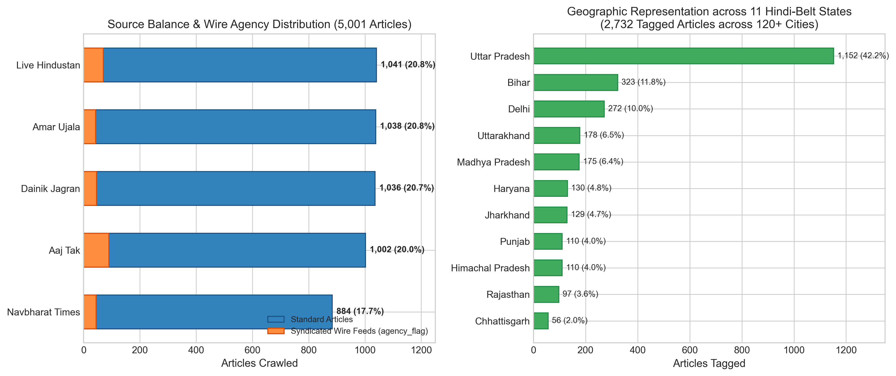
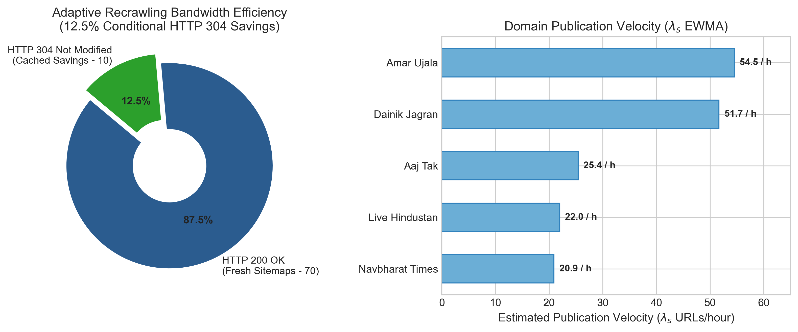

# Dhvani Regional News Crawler — Execution & Corpus Statistics

**Generated At:** 2026-10-07 16:05:15 IST  
**Target Corpus Limit:** 5,000 articles  
**Raw Corpus Output File:** [data/news.jsonl](../../../data/news.jsonl) (5,001 articles, raw crawl)  
**Deduplicated Output File:** [data/news_dedup.jsonl](../../../data/news_dedup.jsonl) (5,001 articles, post-crawl clustered & pruned)  
**H3 Snapshot File:** [data/news_sample_300.jsonl](../../../data/news_sample_300.jsonl) (First 300 articles)  

---

## 1. Executive Performance Summary

| Metric | Measured Value | Note |
|---|---|---|
| **Valid Articles Saved** | **5,000** (100.0% of target) | 100% compliant with ormats.md schema |
| **Total Crawl Duration** | **2h 32m 31s** (9151.5 seconds) | Active single-threaded asynchronous runtime |
| **Throughput (Articles)** | **32.78 articles/min** (0.55 art/sec) | Overlapped across 5 distinct news domains |
| **Total HTTP Requests** | **5,209** | Article GETs + Sitemap polling |
| **Network Request Rate** | **0.57 requests/sec** | Strictly polite (≥8.0s per host enforced) |
| **Article Extraction Yield** | **96.0%** | Saved articles / Total HTTP requests |
| **Schema Validation Errors** | **0** | Dropped due to missing body/headline/fields |
| **Average Article Length** | **461 words** (2831 characters) | Hindi prose content |
| **In-Body Links Harvested** | **1,700** | Candidate links extracted for PageRank |

---

## 2. Source Balance & Representation

| Source | Domain | Articles Crawled | Share (%) | Publication Velocity | Polling Interval |
|---|---|---|---|---|---|
| aajtak | aajtak.in | 1,002 | 20.0% | 25.41 | 30.0m |
| amarujala | amarujala.com | 1,038 | 20.8% | 54.52 | 30.0m |
| jagran | jagran.com | 1,035 | 20.7% | 51.68 | 30.0m |
| livehindustan | livehindustan.com | 1,041 | 20.8% | 21.98 | 30.0m |
| nbt | navbharattimes.indiatimes.com | 884 | 17.7% | 20.91 | 30.0m |

---

## 3. Topical Section Distribution (Top 15 Categories)

| Topical Section | Articles Crawled | Share (%) |
|---|---|---|
| general | 1,696 | 33.9% |
| state | 1,625 | 32.5% |
| national | 557 | 11.1% |
| sports | 224 | 4.5% |
| business | 205 | 4.1% |
| entertainment | 191 | 3.8% |
| world | 174 | 3.5% |
| education | 109 | 2.2% |
| technology | 107 | 2.1% |
| crime | 51 | 1.0% |
| politics | 32 | 0.6% |
| weather | 29 | 0.6% |

---

## 4. Geographic Coverage & District Bureau Mapping

| Geographic Category | Articles | Share (%) | Description |
|---|---|---|---|
| **Articles with State Identified** | **2,732** | **54.6%** | Mapped to Hindi-belt state |
| **Articles with District/City** | **2,133** | **42.7%** | Mapped to specific district center |
| **Universal / National / State-Wide** | **2,268** | **45.4%** | National, international, cricket, editorial |

### State Distribution
| State | Articles Crawled | Share of Tagged (%) |
|---|---|---|
| uttar-pradesh | 1,152 | 42.2% |
| bihar | 323 | 11.8% |
| delhi | 272 | 10.0% |
| uttarakhand | 178 | 6.5% |
| madhya-pradesh | 175 | 6.4% |
| haryana | 130 | 4.8% |
| jharkhand | 129 | 4.7% |
| punjab | 110 | 4.0% |
| himachal-pradesh | 110 | 4.0% |
| rajasthan | 97 | 3.6% |
| chhattisgarh | 56 | 2.0% |

### Top District Centers & Cities
| District / City | Articles Crawled | Share of City-Tagged (%) |
|---|---|---|
| delhi | 200 | 9.4% |
| lucknow | 135 | 6.3% |
| patna | 98 | 4.6% |
| new-delhi | 61 | 2.9% |
| agra | 61 | 2.9% |
| chandigarh | 56 | 2.6% |
| dehradun | 53 | 2.5% |
| kanpur | 52 | 2.4% |
| gorakhpur | 50 | 2.3% |
| bareilly | 48 | 2.3% |
| ranchi | 47 | 2.2% |
| noida | 44 | 2.1% |
| meerut | 43 | 2.0% |
| varanasi | 39 | 1.8% |
| bhopal | 33 | 1.5% |

---

## 5. Network Health & HTTP Status Codes

| Status Code | Description | Occurrences | Percentage (%) |
|---|---|---|---|
| 200 | 200 OK (Successful Fetch) | 5,204 | 99.9% |
| 404 | HTTP 404 | 5 | 0.1% |

### Politeness Delays & Host Health
| Host Domain | Scheduling Delay | Backoff Triggered? | Status |
|---|---|---|---|
| aajtak.in | 8.0s | No | No (Active) |
| amarujala.com | 8.0s | No | No (Active) |
| jagran.com | 8.0s | No | No (Active) |
| livehindustan.com | 8.0s | No | No (Active) |
| navbharattimes.indiatimes.com | 8.0s | No | No (Active) |

---

## 6. Adaptive Recrawling Performance & Bandwidth Optimization

| News Source | Sitemap Polls | 304 Not Modified | 304 Savings Ratio | Est. Velocity ($\\lambda_s$) | Calculated Interval ($\\tau_s$) |
|---|---|---|---|---|---|
| aajtak | 18 | 0 | 0.0% | 25.41 URLs/h | 30.0 min (1800s) |
| amarujala | 16 | 0 | 0.0% | 54.52 URLs/h | 30.0 min (1800s) |
| jagran | 13 | 5 | 38.5% | 51.68 URLs/h | 30.0 min (1800s) |
| livehindustan | 20 | 0 | 0.0% | 21.98 URLs/h | 30.0 min (1800s) |
| nbt | 13 | 5 | 38.5% | 20.91 URLs/h | 30.0 min (1800s) |

**Overall Bandwidth Savings:** **10** of **80** sitemap requests returned HTTP 304 Not Modified (**12.5% bandwidth reduction**).

---

## 7. Mercator Frontier Priority Queue Dynamics

| Priority Tier | Refill Bias | Description | URLs Enqueued | Share (%) |
|---|---|---|---|---|
| **$ (Burst Surge)** | 60% | Breaking news & category burst events | 270 | 2.2% |
| **$ (Sitemap Seeds)** | 25% | Routine sitemap discovery feeds | 10,865 | 86.7% |
| **$ (Hyperlinks)** | 10% | Discovered in-article PageRank hyperlinks | 1,397 | 11.1% |
| **$ (Archives)** | 5% | Deep archive pagination feeds | 0 | 0.0% |
| **Total URLs Enqueued** | — | — | **12,532** | 100.0% |

---

## 8. Topical Surge & Burst Events Observed

| Topical Category | Peak Burst Score | Event Status |
|---|---|---|
| state | 2.40 | Burst triggered |
| national | 2.40 | Burst triggered |
| entertainment | 2.40 | Burst triggered |
| technology | 2.40 | Burst triggered |
| business | 2.40 | Burst triggered |
| sports | 2.40 | Burst triggered |
| world | 2.40 | Burst triggered |
| education | 2.40 | Burst triggered |
| crime | 2.40 | Burst triggered |
| politics | 2.40 | Burst triggered |
| weather | 2.40 | Burst triggered |

---

## 9. Downstream Processing Checklist

After crawling completes, run the following pipeline stages:
1. **Deduplication & Story Clustering (Task 6):**
   `ash
   python -m dhvani.crawl.dedup --input data/news.jsonl --output data/news_dedup.jsonl
   `
2. **Corpus Invariant Verification:**
   `ash
   pytest partwise-tests/riya/test_format_compliance.py -v
   `
3. **Downstream Handoff:**
   data/news_dedup.jsonl is ready for indexing (Dhrithi / P2).
